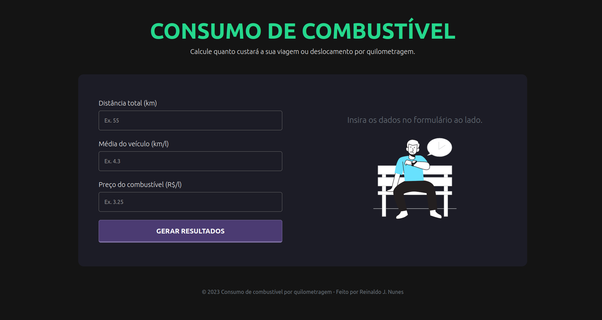

<h1 align="center"> Cálculo de Consumo de Combustível - v. 2.0 </h1>

<p align="center">
  Recriação do projeto [Fuel Calc Js](https://github.com/reinaldonunes/fuel-calc-js) utilizando Vue.js + TypeScript.
</p>

<br>

<p align="center">
  
</p>

## 🚀 Tecnologias

Esse projeto foi desenvolvido com as seguintes tecnologias:

- [Vue.js](https://vuejs.org/)
- [TypeScript](https://www.typescriptlang.org/)
- [Bootstrap Vue](https://bootstrap-vue.org/)
- [Vite](https://vitejs.dev/)

## 💻 Projeto

O projeto gera o cálculo de consumo de combutível por quilometragem ou por deslocamento total, utilizando para isso três informações essenciais: a distância a ser percorrida, a km média feita por litro do veículo e o preço do atual combustível.

<h1 align="center"> Setup Front-end & Back-end</h1>

## 🔥 Front-end

Instale as dependências do projeto:

```
npm install
```

Rode a aplicação:

```
npm run dev
```

ou

```
npm run build
```

<h4 align="center">
 
  <br />
  Feito com ♥ no Ubuntu 22.04 LTS
</h1>
